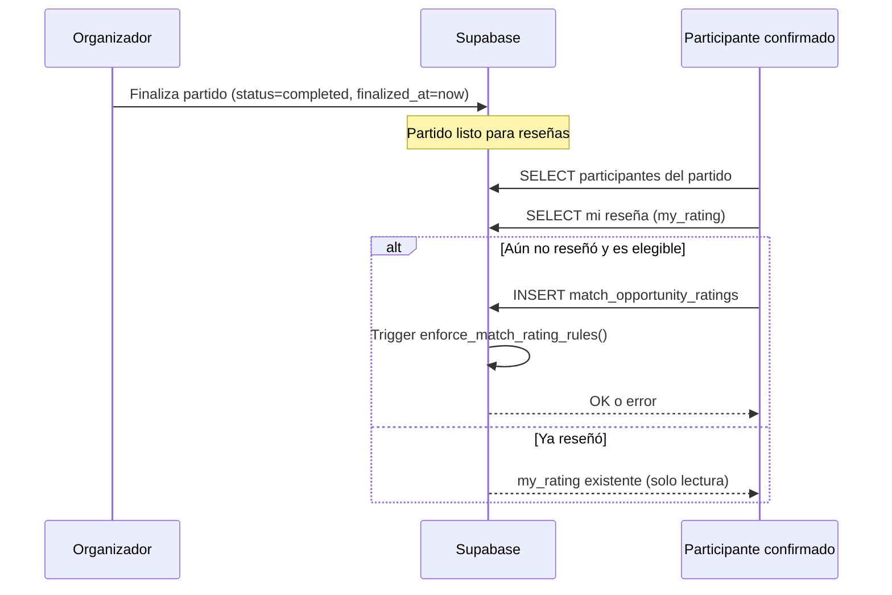

# Documentación completa: sistema de reseñas

Documento de referencia para integrar reseñas en la **app móvil React Native (Expo)** y cualquier otro cliente que use el mismo backend Supabase.

**Backend compartido:** Supabase (PostgreSQL + RLS + PostgREST + Realtime).

**Migraciones clave:** `20260607120000_unified_match_participant_review.sql`, `20260608120000_player_mvp_stats_and_no_self_vote.sql`

---

## 1. Resumen ejecutivo

Existen **dos sistemas de reseñas distintos** en la plataforma. No deben mezclarse en la UI:

| Sistema | Tabla | Cuándo aplica | Una reseña por |
|--------|-------|---------------|----------------|
| **Reseña de partido** (principal) | `match_opportunity_ratings` | Partido **finalizado** (`status = completed`) | Usuario + partido |
| **Reseña de centro (solo cancha)** | `sports_venue_reviews` | Reserva de cancha **sin partido**, ya terminada | Reserva (`venue_reservation_id`) |

Este documento se centra en la **reseña unificada de partido**, que es la que deben implementar en la app móvil para partidos jugados.

### Formato actual de reseña de partido (desde junio 2026)

Un solo formulario por participante, con **4 campos obligatorios** + comentario opcional:

1. **Recinto deportivo** → `venue_rating` (1–5 estrellas)
2. **Ambiente del partido** → `match_rating` (1–5)
3. **Nivel del partido** → `level_rating` (1–5)
4. **MVP del partido** → `mvp_user_id` (UUID de **otro** participante elegible; **no auto-voto**)
5. **Comentario** → `comment` (opcional, máx. 2000 caracteres)

**Reglas de negocio:**

- Solo cuando el partido está `completed` y tiene `finalized_at`.
- **Sin caducidad:** el participante puede reseñar cuando quiera (se eliminó la ventana de 48 h).
- **Una sola reseña por usuario y partido** (constraint `UNIQUE (opportunity_id, rater_id)`).
- Solo **INSERT**; no hay UPDATE en políticas RLS (no se puede editar la reseña enviada).
- Quién puede reseñar: **organizador** (`match_opportunities.creator_id`) **o** participante con `status = confirmed`.
- El MVP elegido debe ser organizador o participante confirmado del mismo partido, **distinto del reseñador** (`mvp_user_id ≠ rater_id`).
- **Contador en perfil:** `stats_mvp_wins` vía RPC `fetch_public_player_profile` o función `player_mvp_wins_count` (+1 por partido donde fue MVP ganador con más votos).

---

## 2. Diagrama de flujo



---

## 3. Esquema SQL

### 3.1 Tabla principal: `match_opportunity_ratings`

Creada en `20250322190000_match_completion_and_ratings.sql` y ampliada en `20260607120000_unified_match_participant_review.sql`.

```sql
CREATE TABLE public.match_opportunity_ratings (
  id UUID PRIMARY KEY DEFAULT gen_random_uuid(),
  opportunity_id UUID NOT NULL REFERENCES public.match_opportunities (id) ON DELETE CASCADE,
  rater_id UUID NOT NULL REFERENCES public.profiles (id) ON DELETE CASCADE,
  -- Legacy (reseñas antiguas antes de unificación):
  organizer_rating SMALLINT CHECK (organizer_rating IS NULL OR (organizer_rating >= 1 AND organizer_rating <= 5)),
  -- Formato actual:
  venue_rating SMALLINT CHECK (venue_rating IS NULL OR (venue_rating >= 1 AND venue_rating <= 5)),
  match_rating SMALLINT NOT NULL CHECK (match_rating >= 1 AND match_rating <= 5),
  level_rating SMALLINT NOT NULL CHECK (level_rating >= 1 AND level_rating <= 5),
  mvp_user_id UUID REFERENCES public.profiles (id) ON DELETE SET NULL,
  comment TEXT CHECK (comment IS NULL OR char_length(comment) <= 2000),
  created_at TIMESTAMPTZ NOT NULL DEFAULT now(),
  UNIQUE (opportunity_id, rater_id)
);

CREATE INDEX idx_mor_opportunity ON public.match_opportunity_ratings (opportunity_id);
CREATE INDEX idx_mor_rater ON public.match_opportunity_ratings (rater_id);
```

**Columnas (mapeo app móvil):**

| Columna DB | Tipo | Obligatorio (nuevas reseñas) | UI |
|------------|------|-------------------------------|-----|
| `opportunity_id` | UUID | Sí | ID del partido |
| `rater_id` | UUID | Sí | `auth.uid()` del usuario logueado |
| `venue_rating` | smallint 1–5 | Sí | Recinto deportivo |
| `match_rating` | smallint 1–5 | Sí | Ambiente del partido |
| `level_rating` | smallint 1–5 | Sí | Nivel del partido |
| `mvp_user_id` | UUID | Sí | Jugador MVP |
| `comment` | text | No | Comentario libre |
| `organizer_rating` | smallint | **No usar** (legacy) | — |

### 3.2 Condiciones del partido (`match_opportunities`)

Para que exista reseña, el partido debe cumplir:

```sql
status = 'completed'::public.match_status
AND finalized_at IS NOT NULL
```

`finalized_at` se setea cuando el organizador (o flujo rival/revuelta) cierra el partido como jugado.

### 3.3 Participantes elegibles

Función helper en BD:

```sql
CREATE OR REPLACE FUNCTION public._match_review_eligible_user(
  p_opportunity_id uuid,
  p_user_id uuid
)
RETURNS boolean
LANGUAGE sql
STABLE
AS $$
  SELECT EXISTS (
    SELECT 1 FROM public.match_opportunities mo
    WHERE mo.id = p_opportunity_id AND mo.creator_id = p_user_id
  )
  OR EXISTS (
    SELECT 1 FROM public.match_opportunity_participants p
    WHERE p.opportunity_id = p_opportunity_id
      AND p.user_id = p_user_id
      AND p.status = 'confirmed'::public.participant_status
  );
$$;
```

**En el cliente (TypeScript / React Native):** misma lógica en `lib/match-review-eligibility.ts`:

- Elegibles para reseñar: usuarios con status `'creator'` o `'confirmed'`.
- Candidatos MVP en el selector: mismos elegibles **excepto** `rater_id` (`filterMvpVoteCandidates` en cliente).

---

## 4. Validación en base de datos (trigger)

Trigger: `trg_match_rating_rules` → función `enforce_match_rating_rules()` (versión actual en migración unificada).

**Comprobaciones al INSERT:**

| Regla | Mensaje de error (EXCEPTION) |
|-------|------------------------------|
| Partido existe | `Oportunidad no existe` |
| Partido finalizado | `Solo se puede calificar un partido finalizado` |
| `rater_id` elegible | `Solo participantes confirmados u organizador pueden dejar reseña` |
| Campos completos | `Completa recinto, ambiente, nivel y MVP` |
| No auto-MVP | `No puedes elegirte a ti mismo como MVP` |
| MVP elegible | `El MVP debe ser un participante del partido` |

**Importante:** No hay ventana temporal. La migración `20260431180200_ratings_remove_48h_window.sql` eliminó el límite de 48 h; la unificación mantiene reseña sin caducidad.

---

## 5. Row Level Security (RLS)

```sql
ALTER TABLE public.match_opportunity_ratings ENABLE ROW LEVEL SECURITY;
```

### SELECT — `mor_select_participants`

Puede leer reseñas del partido quien sea:

- Organizador del partido, **o**
- Participante con `status = confirmed` en ese partido.

```sql
CREATE POLICY mor_select_participants
  ON public.match_opportunity_ratings FOR SELECT TO authenticated
  USING (
    EXISTS (
      SELECT 1 FROM public.match_opportunities mo
      WHERE mo.id = opportunity_id
        AND (
          mo.creator_id = auth.uid()
          OR EXISTS (
            SELECT 1 FROM public.match_opportunity_participants p
            WHERE p.opportunity_id = mo.id
              AND p.user_id = auth.uid()
              AND p.status = 'confirmed'
          )
        )
    )
  );
```

### INSERT — `mor_insert_self_eligible`

Solo el propio usuario, partido finalizado, y elegible según `_match_review_eligible_user`:

```sql
CREATE POLICY mor_insert_self_eligible
  ON public.match_opportunity_ratings FOR INSERT TO authenticated
  WITH CHECK (
    auth.uid() = rater_id
    AND EXISTS (
      SELECT 1 FROM public.match_opportunities
      WHERE id = opportunity_id
        AND status = 'completed'
        AND finalized_at IS NOT NULL
        AND _match_review_eligible_user(id, auth.uid())
    )
  );
```

**No hay política UPDATE ni DELETE** para usuarios normales → reseña inmutable tras envío.

---

## 6. Realtime

La tabla está en la publicación Realtime de Supabase:

```sql
ALTER PUBLICATION supabase_realtime ADD TABLE public.match_opportunity_ratings;
```

En móvil puedes suscribirte a cambios por `opportunity_id` para refrescar contadores o detectar nueva reseña de otros participantes.

---

## 7. RPCs recomendados (PostgREST)

### 7.1 Detalle de partido — `match_detail_ratings_bundle`

Un solo round-trip para pantalla de detalle:

```typescript
const { data, error } = await supabase.rpc('match_detail_ratings_bundle', {
  p_opportunity_id: opportunityId,
})
```

**Respuesta JSON:**

```json
{
  "rating_rows": [
    {
      "opportunity_id": "uuid",
      "venue_rating": 4,
      "match_rating": 5,
      "level_rating": 4,
      "mvp_user_id": "uuid-jugador"
    }
  ],
  "comments": [
    { "comment": "Muy buen partido", "created_at": "2026-06-07T12:00:00Z" }
  ],
  "my_rating": {
    "id": "uuid",
    "opportunity_id": "uuid",
    "rater_id": "uuid",
    "venue_rating": 5,
    "match_rating": 4,
    "level_rating": 5,
    "mvp_user_id": "uuid",
    "comment": null,
    "created_at": "2026-06-07T13:00:00Z"
  }
}
```

- `my_rating` es `null` si el usuario aún no reseñó.
- `comments`: últimos 4 comentarios no vacíos.
- `rating_rows`: todas las filas del partido (para agregados).

**Permisos:** `GRANT EXECUTE ... TO authenticated`. Respeta RLS (`SECURITY INVOKER`).

### 7.2 Hub de partidos — `matches_hub_secondary_bundle`

Para listado de partidos finalizados (promedios en tarjetas):

```typescript
const { data } = await supabase.rpc('matches_hub_secondary_bundle', {
  p_finished_opp_ids: ['uuid1', 'uuid2'],
  p_chat_opp_ids: [],
  p_reservation_ids: [],
})
// data.rating_rows → agregar por opportunity_id
```

---

## 8. Consultas REST directas (alternativa sin RPC)

### 8.1 ¿Ya reseñé este partido?

```typescript
const { data } = await supabase
  .from('match_opportunity_ratings')
  .select('id, opportunity_id, rater_id, venue_rating, match_rating, level_rating, mvp_user_id, comment, created_at')
  .eq('opportunity_id', opportunityId)
  .eq('rater_id', userId)
  .maybeSingle()
// data === null → puede mostrar formulario
```

### 8.2 Enviar reseña

```typescript
const { error } = await supabase.from('match_opportunity_ratings').insert({
  opportunity_id: opportunityId,
  rater_id: userId, // debe coincidir con auth.uid()
  venue_rating: 5,
  match_rating: 4,
  level_rating: 4,
  mvp_user_id: selectedPlayerId,
  comment: comment?.trim() || null,
})
```

**Payload mínimo válido (nuevo formato):**

```typescript
type SubmitMatchReviewPayload = {
  opportunityId: string
  venueRating: number      // 1-5
  matchRating: number      // 1-5
  levelRating: number      // 1-5
  mvpUserId: string        // UUID profiles.id
  comment?: string         // opcional, max 2000
}
```

### 8.3 Listar participantes (selector MVP)

Misma lógica que web en `fetchParticipantsForOpportunity`:

1. `SELECT creator_id FROM match_opportunities WHERE id = ?`
2. `SELECT user_id, status, ... FROM match_opportunity_participants WHERE opportunity_id = ?`
3. `SELECT id, name, photo_url FROM profiles WHERE id IN (...)`
4. Armar lista: organizador con `status: 'creator'` + resto con su `status` real.
5. Filtrar MVP/reseña: `status === 'creator' || status === 'confirmed'`.

### 8.4 Resumen de reseñas del partido

```typescript
const { data: rows } = await supabase
  .from('match_opportunity_ratings')
  .select('opportunity_id, venue_rating, match_rating, level_rating, mvp_user_id')
  .eq('opportunity_id', opportunityId)
```

Agregación en cliente (igual que `lib/supabase/rating-queries.ts`):

```typescript
type RatingSummary = {
  opportunityId: string
  count: number
  avgVenue: number | null      // redondeo 1 decimal
  avgMatch: number | null
  avgLevel: number | null
  avgOverall: number | null    // media de venue+match+level por reseña
  mvpTally: { userId: string; votes: number }[]  // ordenado desc por votes
}
```

**Cálculo MVP:**

```typescript
function tallyMvpVotes(mvpUserIds: (string | null | undefined)[]) {
  const counts = new Map<string, number>()
  for (const id of mvpUserIds) {
    if (!id) continue
    counts.set(id, (counts.get(id) ?? 0) + 1)
  }
  return [...counts.entries()]
    .map(([userId, votes]) => ({ userId, votes }))
    .sort((a, b) => b.votes - a.votes)
}
```

**MVP ganador:** `mvpTally[0]` (empates: mismo número de votos; la UI web muestra el primero tras sort estable).

**Compatibilidad legacy:** si una fila antigua tiene `organizer_rating` y no `venue_rating`, usar `organizer_rating` como sustituto de recinto al calcular `avgVenue` / `avgOverall`.

---

## 9. Lógica de UI (pantalla móvil sugerida)

### Cuándo mostrar el formulario

```typescript
const canShowReviewForm =
  match.status === 'completed' &&
  match.finalizedAt != null &&
  userCanSubmitMatchReview(currentUserId, participants) &&
  myRating == null
```

### Cuándo mostrar “Ya enviaste tu reseña”

```typescript
const alreadyReviewed = myRating != null
```

### Campos del formulario

| Label UI | Campo | Validación cliente |
|----------|-------|-------------------|
| Recinto deportivo | `venue_rating` | 1–5, obligatorio |
| Ambiente del partido | `match_rating` | 1–5, obligatorio |
| Nivel del partido | `level_rating` | 1–5, obligatorio |
| MVP del partido | `mvp_user_id` | picker entre elegibles, obligatorio |
| Comentario (opcional) | `comment` | max 2000 chars |

### Pantalla de resumen (partido finalizado)

Mostrar tarjetas:

- Número de reseñas (`count`)
- Promedio general (`avgOverall`)
- Promedio recinto / ambiente / nivel
- MVP más votado: nombre del jugador + `(N votos)` usando `participants` + `mvpTally[0]`
- Lista de comentarios recientes (hasta 4)

---

## 10. Tipos TypeScript (copiar a Expo)

```typescript
export type MatchOpportunityRatingRow = {
  id: string
  opportunity_id: string
  rater_id: string
  organizer_rating?: number | null  // legacy
  venue_rating: number | null
  match_rating: number
  level_rating: number
  mvp_user_id: string | null
  comment: string | null
  created_at: string
}

export type RatingSummary = {
  opportunityId: string
  count: number
  avgVenue: number | null
  avgMatch: number | null
  avgLevel: number | null
  avgOverall: number | null
  mvpTally: { userId: string; votes: number }[]
}

export type OpportunityParticipant = {
  id: string
  name: string
  photo: string
  status: 'creator' | 'confirmed' | 'pending' | 'invited' | 'cancelled'
}
```

---

## 11. Errores habituales y manejo en móvil

| Origen | Causa | Acción UX |
|--------|-------|-----------|
| `23505` unique violation | Usuario ya reseñó | Mostrar reseña existente, ocultar formulario |
| `Completa recinto, ambiente, nivel y MVP` | Falta campo | Validar antes de enviar |
| `Solo se puede calificar un partido finalizado` | Partido no cerrado | Ocultar formulario |
| `Solo participantes confirmados...` | Usuario no elegible | Ocultar formulario |
| `El MVP debe ser un participante...` | MVP inválido | Refrescar lista participantes |
| RLS / 403 | Token inválido o no participante | Re-login o mensaje genérico |

---

## 12. Sistema separado: reseñas de centro (solo reserva cancha)

**No confundir con reseñas de partido.**

Tabla: `sports_venue_reviews`  
Migración: `20260429200000_sports_venue_reviews.sql`

Aplica cuando el jugador reservó **solo cancha** (`venue_reservations.match_opportunity_id IS NULL`), la reserva terminó (`ends_at < now()`), y aún no reseñó esa reserva.

Campos:

- `court_quality` (1–5)
- `management_rating` (1–5)
- `facilities_rating` (1–5)
- `comment`
- `reviewer_name_snapshot` (obligatorio al insertar)

Una reseña por `venue_reservation_id`.

Vista agregada pública: `sports_venue_review_stats` (lectura anon para ficha del centro).

---

## 13. Legacy / deprecado

### `organizer_rating`

Antes de la unificación, las reseñas pedían “gestión del organizador” en lugar de recinto. Las filas antiguas pueden tener `organizer_rating` y `venue_rating = null`. El cliente debe:

- **Enviar siempre** `venue_rating` + `mvp_user_id` en reseñas nuevas.
- **Al leer**, usar `venue_rating ?? organizer_rating` para promedios.

### `rival_team_match_reviews`

Tabla y RPC `submit_rival_team_match_review` para valorar al **equipo contrario** en duelos rival. **Deprecado en UI web** (junio 2026): todo pasa por `match_opportunity_ratings`. No implementar en móvil salvo compatibilidad histórica.

---

## 14. Historial de migraciones relevantes

| Archivo | Qué hace |
|---------|----------|
| `20250322190000_match_completion_and_ratings.sql` | Crea tabla, trigger inicial, RLS, ventana 48 h |
| `20260431180200_ratings_remove_48h_window.sql` | Elimina caducidad 48 h |
| `20260431130000_matches_hub_and_detail_ratings_bundle_rpc.sql` | RPCs bundle (actualizados después) |
| `20260607120000_unified_match_participant_review.sql` | **Formato actual:** `venue_rating`, `mvp_user_id`, reglas unificadas, RPCs actualizados |
| `20260608120000_player_mvp_stats_and_no_self_vote.sql` | No auto-MVP, `player_mvp_wins_count`, `stats_mvp_wins` en perfil público |

**Orden de despliegue móvil:** el backend debe tener aplicada **como mínimo** la migración `20260607120000` antes de enviar reseñas con el nuevo payload.

---

## 15. SQL completo del formato actual (referencia)

Contenido efectivo tras migración unificada (funciones + columnas nuevas):

```sql
-- Columnas nuevas
ALTER TABLE public.match_opportunity_ratings
  ADD COLUMN IF NOT EXISTS venue_rating SMALLINT
    CHECK (venue_rating IS NULL OR (venue_rating >= 1 AND venue_rating <= 5)),
  ADD COLUMN IF NOT EXISTS mvp_user_id UUID REFERENCES public.profiles (id) ON DELETE SET NULL;

-- Elegibilidad
CREATE OR REPLACE FUNCTION public._match_review_eligible_user(
  p_opportunity_id uuid, p_user_id uuid
) RETURNS boolean LANGUAGE sql STABLE AS $$ ... $$;

-- Trigger (validación INSERT)
CREATE OR REPLACE FUNCTION public.enforce_match_rating_rules()
RETURNS TRIGGER LANGUAGE plpgsql SECURITY DEFINER AS $$ ... $$;

-- Política INSERT actualizada
CREATE POLICY mor_insert_self_eligible ON public.match_opportunity_ratings ...;

-- RPC detalle
CREATE OR REPLACE FUNCTION public.match_detail_ratings_bundle(p_opportunity_id uuid) ...;

-- RPC hub
CREATE OR REPLACE FUNCTION public.matches_hub_secondary_bundle(...) ...;
```

El archivo completo está en:

`supabase/migrations/20260607120000_unified_match_participant_review.sql`

---

## 16. Checklist implementación Expo

- [ ] Supabase client con sesión JWT (`auth.uid()` en inserts)
- [ ] Pantalla detalle partido: cargar `match_detail_ratings_bundle` o consultas REST equivalentes
- [ ] Cargar participantes del partido para picker MVP
- [ ] Mostrar formulario solo si `completed` + elegible + `my_rating === null`
- [ ] Selector MVP sin el usuario actual (`filterMvpVoteCandidates`)
- [ ] Validar anti auto-MVP en cliente antes de POST
- [ ] Insert en `match_opportunity_ratings` con snake_case columns
- [ ] Manejar error unique (ya reseñó)
- [ ] Mostrar resumen: promedios + MVP + comentarios
- [ ] (Opcional) Suscripción Realtime a `match_opportunity_ratings`
- [ ] **No** mezclar con `sports_venue_reviews` en flujo de partido
- [ ] **No** usar `submit_rival_team_match_review` (legacy)

---

## 17. Referencias en proyecto web (Next.js)

| Archivo | Responsabilidad |
|---------|-----------------|
| `lib/match-review-eligibility.ts` | Elegibilidad, `filterMvpVoteCandidates`, conteo MVP |
| `lib/supabase/mvp-queries.ts` | RPC `player_mvp_wins_count` (perfil propio) |
| `lib/supabase/rating-queries.ts` | Tipos, fetch, agregados |
| `lib/services/match-detail.service.ts` | Parse RPC detalle |
| `lib/services/matches-hub.service.ts` | Parse RPC hub |
| `lib/app-context.tsx` → `submitMatchRating` | Insert Supabase |
| `components/match-completion-panel.tsx` | Formulario UI web |
| `supabase/migrations/20260607120000_unified_match_participant_review.sql` | Fuente de verdad SQL |

---

*Última actualización: junio 2026 — reseña unificada, no auto-MVP, contador MVP en perfil.*
