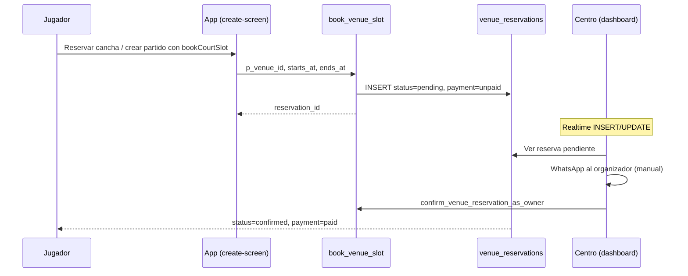

# Documentación — Usuario Centro Deportivo (SportMatch)

Referencia funcional y técnica de **todo lo implementado** para el rol **centro deportivo** (`account_type = 'venue'`) en la app SportMatch.

**Última revisión:** mayo 2026 · **Código base:** repositorio SportMatch (Next.js + Supabase)

---

## 1. Resumen ejecutivo

El **centro deportivo** es un tipo de cuenta privilegiada orientada a la **operación de un recinto**: gestionar canchas, horarios, precios, reservas y métricas de negocio. No comparte la experiencia del jugador (sin barra inferior, sin partidos propios, sin equipos).

| Aspecto | Detalle |
|---------|---------|
| Identificador en BD | `profiles.account_type = 'venue'` |
| Entidad principal | `sports_venues` (1 centro por `owner_id`) |
| Pantallas propias | `venueOnboarding`, `venueDashboard` |
| Alta pública | **No** — el registro estándar crea siempre `player` |
| Pagos integrados | **No** — cobro manual + confirmación en panel |
| WhatsApp | Enlaces `wa.me` con mensajes prefabricados (sin API Business) |
| Notificaciones push | **No** dedicadas al dueño (solo Realtime en dashboard) |

---

## 2. Cómo se crea una cuenta centro

### 2.1 Registro público (jugador)

Cualquier usuario que se registra desde la app nace como **`player`**. La política RLS de `profiles` impide auto-asignarse `account_type = 'venue'`.

### 2.2 Camino A — Admin crea centro + dueño (recomendado)

**UI:** pestaña **Nuevo centro** en `components/admin-dashboard-screen.tsx`  
**API:** `POST /api/admin/create-venue-user` (`app/api/admin/create-venue-user/route.ts`)

**Flujo:**

1. Un administrador autenticado envía email, contraseña, nombre del centro, teléfono (+569 + 8 dígitos), dirección, ciudad, maps (opcional).
2. Se crea usuario en Supabase Auth (`email_confirm: true`).
3. Se upsertea `profiles` con `account_type: 'venue'`.
4. Se inserta fila en `sports_venues` (`slot_duration_minutes: 60`, `is_paused: false`).
5. El dueño inicia sesión → va directo a **`venueDashboard`**.

### 2.3 Camino B — Promoción manual SQL + onboarding

**Script:** `supabase/manual_promote_venue_account.sql`

1. Usuario se registra como jugador.
2. Admin ejecuta `UPDATE profiles SET account_type = 'venue' WHERE id = ...`.
3. Al iniciar sesión → **`venueOnboarding`** (aún no existe fila en `sports_venues`).
4. Completa el formulario de alta → se crea el centro → **`venueDashboard`**.

### 2.4 Camino C — Onboarding self-service

Si la cuenta ya tiene `account_type = 'venue'` pero no hay centro en BD:

**Pantalla:** `components/venue-onboarding-screen.tsx`  
**Acción:** `completeVenueOnboarding()` en `lib/app-context.tsx`

**Campos del formulario:**

| Campo | Obligatorio | Notas |
|-------|-------------|-------|
| Nombre del centro | Sí | Público |
| Dirección | Sí | |
| Ciudad / región | Sí | `GeoLocationSelect` → `city_id` |
| Teléfono | Sí | Contacto del centro |
| Google Maps URL | No | |
| Duración de tramo | Sí | 15–180 min, default **60** (`slot_duration_minutes`) |

Al guardar: `INSERT` en `sports_venues` + update `profiles.name` → redirección al dashboard.

---

## 3. Autenticación, sesión y navegación

### 3.1 Destino tras login

Lógica en `lib/app-context.tsx` → `login()` y efecto de guardia (~línea 2898):

| Perfil | Condición | Pantalla |
|--------|-----------|----------|
| `admin` | — | `adminDashboard` |
| `venue` | Sin fila en `sports_venues` | `venueOnboarding` |
| `venue` | Con centro cargado | `venueDashboard` |
| `player` | — | `home` u onboarding jugador |

### 3.2 Restricción de pantallas

Si `account_type === 'venue'`, cualquier pantalla que **no** sea `venueDashboard` o `venueOnboarding` redirige automáticamente al dashboard del centro.

**Excluido para centros:**

- Barra inferior de jugador (`components/bottom-nav.tsx`)
- `home`, `explore`, `matches`, `create`, `teams`, `profile` (jugador)
- Flujos de partidos, equipos e invitaciones (bundles vaciados al login venue)

### 3.3 Carga de datos al iniciar sesión

- Se carga **solo** el centro del dueño: `loadVenueForOwner()` (`lib/supabase/venue-queries.ts`).
- Incluye centros **pausados** (`is_paused = true`): el dueño sigue viendo su panel aunque el centro no aparezca en búsquedas públicas.

### 3.4 Cambio de contraseña

En pestaña **Perfil** del dashboard: re-autenticación con contraseña actual + `updateUser({ password })`.

---

## 4. Pantallas y rutas

### 4.1 Pantallas internas (SPA en `/`)

Definidas en `lib/app-context-contract.ts`, render en `app/page.tsx`:

| Screen ID | Componente | Cuándo |
|-----------|------------|--------|
| `venueOnboarding` | `VenueOnboardingScreen` | Cuenta venue sin `sports_venues` |
| `venueDashboard` | `VenueDashboardScreen` | Cuenta venue con centro |

### 4.2 Rutas Next.js relacionadas

| Ruta | Quién la usa | Propósito |
|------|--------------|-----------|
| `/` (`?screen=venueDashboard`) | Dueño logueado | Panel operativo |
| `/centro/[venueId]` | Público / jugadores | Ficha pública del centro |
| `/para-centros` | Público | Landing B2B marketing |
| `/api/admin/*` | Solo admin | CRUD centros y credenciales dueño |

El dueño **no** consume rutas API propias: opera vía cliente Supabase + RLS.

### 4.3 Estado sin centro vinculado

Si `account_type = venue` pero falta fila en `sports_venues`, el dashboard muestra instrucciones para completar onboarding o contactar al admin.

---

## 5. Dashboard del centro — estructura general

**Archivo principal:** `components/venue-dashboard-screen.tsx`

**Header:** nombre del centro, selector de tema claro/oscuro, botón **Salir** (logout).

**5 pestañas:**

| ID | Etiqueta | Función principal |
|----|----------|-------------------|
| `dashboard` | **Resumen** | BI, disponibilidad en vivo, historial |
| `bookings` | **Reservas** | Operación diaria y próximas reservas |
| `profile` | **Perfil** | Nombre, teléfono, contraseña |
| `courts` | **Canchas** | CRUD canchas y precios por hora |
| `hours` | **Horario** | Horario semanal de apertura |

---

## 6. Pestaña Resumen (`dashboard`)

### 6.1 Business Intelligence (BI)

**Hooks:** `lib/venue-bi/hooks/*`  
**Componentes UI:** `components/venue-bi/*`  
**Queries RPC:** `lib/supabase/venue-bi-queries.ts`

**Filtros de periodo** (`VenueBiFiltersToolbar`):

- Hoy
- Últimos 7 días
- Últimos 30 días
- Rango personalizado (fecha inicio / fin)

**Métricas y visualizaciones:**

| Elemento | RPC / origen |
|----------|--------------|
| Tarjetas KPI | `bi_venue_kpis_snapshot` |
| Gráfico ingresos | `bi_venue_income_timeseries` |
| Desglose por cancha | `bi_venue_courts_breakdown` |
| Panel de alertas | Derivado de KPIs |
| Export CSV | `useVenueBiCsvExport` |

**KPIs típicos:** ocupación, ingresos, ticket promedio, cancelaciones, horas muertas, clientes recurrentes, alertas operativas.

**Fallbacks:**

- Variable `NEXT_PUBLIC_VENUE_BI_USE_MOCK=1` → datos mock (`lib/venue-bi/mock.ts`).
- Si fallan RPCs BI → banner ámbar + **resumen clásico** (legacy).

### 6.2 Resumen clásico (legacy / fallback)

- **Cupos libres hoy:** franjas libres vs total según horario, canchas activas y reservas del día.
- **Ahora (en vivo):** tramo actual alineado a `slot_duration_minutes`.
- **Historial en el periodo:** filtro `all` / `pending` / `confirmed` / `cancelled`, paginación «Cargar más».

**Datos:** `fetchVenueReservationsRange()` para el rango seleccionado.

---

## 7. Pestaña Reservas (`bookings`)

### 7.1 Submodos

| Modo | Descripción |
|------|-------------|
| **Por día** | Calendario con chips Hoy / 3 días / 7 días; navegación día a día |
| **Próximas** | Ventana de **45 días**, agrupadas por fecha; métricas de reservas activas e ingresos estimados |

### 7.2 Acciones globales

- **Copiar página pública** → URL `/centro/{venueId}`.
- **Nueva reserva manual** → reserva externa (cliente fuera de la app).

### 7.3 Tarjeta de cada reserva

**Información mostrada:**

- Cancha, estado (`pending` / `confirmed` / `cancelled`)
- Badge de pago si `paid` o `deposit_paid`
- Horario inicio–fin, precio (`price_per_hour`)
- Si hay partido vinculado: título del partido
- Organizador / reservante: nombre + teléfono WhatsApp (desde `profiles.whatsapp_phone`)

**Acciones:**

| Botón | Efecto |
|-------|--------|
| **WhatsApp** | Abre `wa.me` con mensaje prefabricado de cobro/abono |
| **Confirmar (pagado)** | RPC `confirm_venue_reservation_as_owner` (`p_mark_paid: true`) |
| **Cancelar** | Prompt de motivo → RPC `cancel_venue_reservation_as_owner` |

### 7.4 Mensajes WhatsApp desde el dashboard (centro → cliente)

**Archivo:** `components/venue-dashboard-screen.tsx`

**Con partido vinculado:**

```
Hola {nombreOrg}. Soy el centro deportivo {nombreVenue}. Para confirmar la reserva del partido “{título}” ({hora}), con fecha {fecha}, necesitamos el abono/pago. ¿Te envío los datos para transferir o link de pago?
```

**Reserva manual / sin partido:**

```
Hola {nombreOrg}. Soy el centro deportivo {nombreVenue}. Para confirmar tu reserva ({hora}) del día {fecha}, necesitamos el abono/pago. ¿Te envío los datos para transferir o link de pago?
```

*(En la vista «Próximas» sin partido, la variante puede omitir «del día {fecha}» en el paréntesis.)*

### 7.5 Flujo: reserva manual

1. Elegir fecha, hora, cancha libre (validación de solapamiento + horario semanal).
2. Estado inicial: `pending` o `confirmed`.
3. Datos opcionales: nombre cliente, WhatsApp (+569), nota interna.
4. `INSERT` directo en `venue_reservations` (política `venue_reservations_insert_owner`).
5. Metadatos en campo `notes`:  
   `manual_reservation | cliente:... | telefono:... | nota:...`
6. `booker_user_id` y `match_opportunity_id` = **null**.

---

## 8. Pestaña Perfil (`profile`)

### 8.1 Editable por el dueño

| Campo | Mutation |
|-------|----------|
| Nombre del centro | `updateSportsVenueNameAndPhone()` |
| Teléfono contacto (+569 + 8 dígitos) | Idem |

**Archivo mutations:** `lib/supabase/venue-owner-mutations.ts`

### 8.2 No editable en panel del dueño

Solo modificables en **onboarding inicial** o por **admin**:

- Dirección
- URL Google Maps
- Ciudad / `city_id`
- Duración de tramo (`slot_duration_minutes`)
- Pausar/reactivar centro (`is_paused`)

---

## 9. Pestaña Canchas (`courts`)

| Acción | Detalle |
|--------|---------|
| **Agregar cancha** | Nombre + `sort_order` |
| **Precio por hora (CLP)** | Guardado al perder foco (`updateVenueCourtPrice()`) |
| **Eliminar cancha** | `deleteVenueCourtById()` — cascade de reservas en BD |

**Estadísticas en UI:** total canchas, activas, precio promedio.

**Comportamiento BD:** al cambiar precio de cancha, trigger `sync_future_reservations_price_from_court` propaga el valor a reservas futuras `pending`/`confirmed`.

---

## 10. Pestaña Horario (`hours`)

- **Atajos:** aplicar horario a toda la semana, lun–vie, cerrar sáb/dom.
- **Por día** (0 = domingo … 6 = sábado): switch abierto/cerrado + hora apertura/cierre.
- **Guardar** → `syncVenueWeeklyHoursFromOwnerUi()` (CRUD en `venue_weekly_hours`).

**Utilidades de slots:** `lib/venue-slots.ts` — cálculo de franjas libres/ocupadas según horario, duración de tramo y reservas.

---

## 11. Modelo de reservas

### 11.1 Tablas involucradas

| Tabla | Rol |
|-------|-----|
| `sports_venues` | Centro (owner, datos públicos, slot duration, pausa) |
| `venue_courts` | Canchas con `price_per_hour` |
| `venue_weekly_hours` | Horario semanal |
| `venue_reservations` | Reservas |
| `venue_reservation_events` | Auditoría / historial |

### 11.2 Estados

```typescript
status: 'pending' | 'confirmed' | 'cancelled'
payment_status: 'unpaid' | 'deposit_paid' | 'paid'
confirmation_source: 'venue_owner' | 'booker_self' | 'admin' | null
```

### 11.3 Campos monetarios

- `price_per_hour`, `deposit_amount`, `paid_amount`, `currency` (default CLP)
- El precio se copia de la cancha al reservar; cambios futuros se sincronizan vía trigger.

### 11.4 Solapamiento y disponibilidad

- Trigger `venue_reservations_check_overlap`: reservas `pending` y `confirmed` bloquean la cancha.
- RPC `book_venue_slot`: asigna primera cancha libre por `sort_order`.
- Error `no_court_available` → mensaje UI: *«No hay cancha libre en ese horario»*.

---

## 12. Flujos con jugadores y partidos

### 12.1 Jugador reserva cancha desde la app



**Modos de entrada del jugador:**

| Flujo | Archivo / RPC |
|-------|---------------|
| Solo reserva cancha | `create-screen.tsx` modo `reserve` → `book_venue_slot` |
| Partido + reserva | `create_match_opportunity_with_optional_reservation` |
| Ficha pública `/centro/[id]` | Redirige a crear con prefill |

**Restricción:** reserva automática al crear partido **no aplica** a partidos tipo **`rival`**.

### 12.2 Vínculos partido ↔ reserva ↔ centro

| Campo | Dirección |
|-------|-----------|
| `match_opportunities.sports_venue_id` | Partido → centro |
| `match_opportunities.venue_reservation_id` | Partido → reserva |
| `venue_reservations.match_opportunity_id` | Reserva → partido |

En el dashboard, reservas con partido muestran título del partido y contactan al **creador** del partido (organizador), no a participantes sueltos.

### 12.3 Reprogramación de partidos

**RPC:** `reschedule_match_opportunity_with_reason`

- Puede cambiar centro vinculado desde lista de centros.
- Migraciones recientes permiten reprogramar/desvincular reserva (`20260431140000`, `20260531200000`).
- **Cancelar reserva desde el centro** puede cancelar el partido vinculado (trigger `handle_venue_reservation_status_change`).

### 12.4 Confirmación desde el lado jugador (no en panel centro)

El organizador/jugador también puede confirmar vía RPC `confirm_venue_reservation_as_booker`:

- Desde detalle de partido (`confirmVenueReservationBookerSelfMatchDetail`)
- Desde hub de partidos, reserva solo-cancha (`confirmSoloVenueReservationFromMatchesHub`)

El centro ve el resultado en su dashboard (estado actualizado + Realtime).

### 12.5 WhatsApp jugador → centro

**Archivo:** `lib/venue-whatsapp-contact.ts` → `buildVenueCourtConfirmationMessage`

```
Hola, soy {nombre}. Quiero confirmar la reserva de cancha en {centro}, {fecha} a las {hora}{detalle}. ¿Podrían confirmarme? Gracias.
```

Usado en pestaña **Próximos** del jugador (`components/matches-screen.tsx`).

---

## 13. Pagos — modelo operativo

**No hay pasarela integrada** (Stripe, Mercado Pago, etc.) para venues.

**Flujo estándar:**

1. Reserva nace: `status = pending`, `payment_status = unpaid`.
2. Centro contacta por WhatsApp (transferencia / link externo).
3. Centro pulsa **Confirmar (pagado)** → RPC marca:
   - `status = confirmed`
   - `payment_status = paid`
   - `confirmation_source = venue_owner`

**Mutations:** `lib/supabase/venue-reservation-mutations.ts`

| Función | RPC |
|---------|-----|
| `confirmVenueReservationAsVenueOwner` | `confirm_venue_reservation_as_owner` |
| `cancelVenueReservationAsVenueOwner` | `cancel_venue_reservation_as_owner` |

**Cancelación:** requiere motivo; si hay partido vinculado, el partido pasa a `cancelled`.

---

## 14. Página pública del centro

**Ruta:** `/centro/[venueId]`  
**Archivos:** `app/centro/[venueId]/page.tsx`, `components/venue-centro-client.tsx`, `lib/supabase/public-venue-server.ts`

**Contenido público:**

- Nombre, ciudad, canchas, horarios
- Grilla de slots del día (`computeDaySlots` + RPC `venue_public_reservations_in_range`)
- Reseñas (`sports_venue_reviews`) — las dejan jugadores tras reservas finalizadas
- Acciones: reservar cancha / crear partido (requiere login; gate auth si no hay sesión)

**Visibilidad:** centros con `is_paused = true` → **404** en ficha pública (el dueño sigue operando en panel).

---

## 15. Realtime

**Archivo:** `components/venue-dashboard-screen.tsx` (~822–909)

| Aspecto | Detalle |
|---------|---------|
| Canal | `venue-dashboard-bookings:{venueId}:{courtIds}` |
| Tabla | `venue_reservations` (publicada en `supabase_realtime`) |
| Eventos | INSERT/UPDATE filtrados por `court_id`; DELETE sin filtro |
| Debounce | 280 ms → recarga reservas del día y resumen |

También en publicación realtime: `sports_venues`, `sports_venue_reviews`.

**Push notifications:** no implementadas para dueños de centro. El centro depende de **Realtime en dashboard** + contacto WhatsApp manual.

---

## 16. Admin vs dueño de centro

| Capacidad | Admin | Dueño centro |
|-----------|-------|--------------|
| Crear cuenta + centro | ✅ `POST /api/admin/create-venue-user` | ❌ |
| Promover `account_type` | ✅ SQL / service role | ❌ |
| Listar todos los centros | ✅ `GET /api/admin/venues` | ❌ (solo el suyo) |
| Editar dirección, maps, ciudad, slot duration | ✅ `PATCH /api/admin/venues/[id]` | ❌ |
| Editar nombre y teléfono | ✅ | ✅ (panel Perfil) |
| Pausar/reactivar (`is_paused`) | ✅ | ❌ |
| Eliminar centro | ✅ `DELETE /api/admin/venues/[id]` | ❌ |
| Cambiar email/contraseña del dueño | ✅ rutas `/owner-email`, `/owner-password` | Solo contraseña propia |
| Gestionar canchas, horarios, reservas | ❌ (salvo update admin en reservas) | ✅ |
| Confirmar/cancelar reservas | ✅ (política RLS) | ✅ (RPC owner) |
| BI de su centro | Indirecto (conoce IDs) | ✅ pestaña Resumen |
| Métricas de red / CEO | ✅ panel admin | ❌ |

**API admin centros:** `app/api/admin/venues/*`, `app/api/admin/create-venue-user/route.ts`  
**Validación dueño:** `lib/supabase/admin-venue-owner.ts`

---

## 17. Permisos RLS (resumen)

**Helper central:**

```sql
is_venue_owner(p_venue_id)  -- owner_id = auth.uid() en sports_venues
```

| Tabla | Dueño puede |
|-------|-------------|
| `sports_venues` | SELECT/INSERT/UPDATE/DELETE del propio centro |
| `venue_courts` | CRUD completo del propio venue |
| `venue_weekly_hours` | CRUD completo del propio venue |
| `venue_reservations` | SELECT; INSERT manual; UPDATE; DELETE; confirm/cancel vía RPC |
| `venue_reservation_events` | SELECT (historial) |

**Migraciones clave:**

- `supabase/migrations/20250327100000_sports_venues_and_bookings.sql` — schema base
- `supabase/migrations/20260326200000_venue_reservations_payments_and_history.sql` — pagos e historial
- `supabase/migrations/20260327012000_venue_manual_reservations_insert_policy.sql` — reservas manuales
- `supabase/migrations/20260408130000_venue_reservation_rpcs.sql` — confirm/cancel owner
- `supabase/migrations/20260502120000_venue_bi_dashboard_block1.sql` — RPCs BI

**Nota de seguridad BI:** las RPC `bi_venue_*` son `SECURITY DEFINER` y están granted a `authenticated` sin comprobar `is_venue_owner(p_venue_id)` en la migración. Cualquier usuario autenticado que conozca un `venue_id` podría consultar agregados BI.

---

## 18. RPCs y operaciones Supabase

### 18.1 Invocadas desde el dashboard del dueño

| RPC | Uso |
|-----|-----|
| `confirm_venue_reservation_as_owner` | Confirmar + marcar pagado |
| `cancel_venue_reservation_as_owner` | Cancelar con motivo |
| `bi_venue_kpis_snapshot` | KPIs resumen |
| `bi_venue_income_timeseries` | Serie de ingresos |
| `bi_venue_courts_breakdown` | Desglose por cancha |

### 18.2 Ecosistema venue (jugadores / público / partidos)

| RPC | Rol |
|-----|-----|
| `book_venue_slot` | Reserva automática (pending) |
| `confirm_venue_reservation_as_booker` | Autoconfirmación jugador |
| `create_match_opportunity_with_optional_reservation` | Partido + reserva atómica |
| `venue_public_reservations_in_range` | Disponibilidad pública `/centro/...` |
| `is_venue_owner(uuid)` | Helper RLS interno |

### 18.3 Operaciones PostgREST directas (dueño, vía RLS)

| Operación | Tabla |
|-----------|-------|
| INSERT centro (onboarding) | `sports_venues` |
| UPDATE nombre/teléfono | `sports_venues` |
| CRUD canchas | `venue_courts` |
| CRUD horarios | `venue_weekly_hours` |
| INSERT reserva manual | `venue_reservations` |
| SELECT reservas, canchas, horarios | Varias |

---

## 19. Marketing B2B

**Ruta:** `/para-centros`  
**Componente:** `components/venue-b2b-public-page.tsx`  
**Textos:** `lib/venue-b2b-marketing.ts`

Landing orientada a centros que quieren publicar canchas en SportMatch, con CTA WhatsApp comercial y demo de métricas (`lib/venue-b2b-demo-bi-data.ts`).

---

## 20. Mapa de archivos clave

| Área | Ruta |
|------|------|
| Dashboard principal | `components/venue-dashboard-screen.tsx` |
| Onboarding | `components/venue-onboarding-screen.tsx` |
| Contexto auth / routing | `lib/app-context.tsx` |
| Contrato de pantallas | `lib/app-context-contract.ts` |
| Tipos | `lib/types.ts` |
| Queries venue | `lib/supabase/venue-queries.ts` |
| Mutations dueño | `lib/supabase/venue-owner-mutations.ts` |
| Mutations reservas | `lib/supabase/venue-reservation-mutations.ts` |
| Queries dashboard (partidos) | `lib/supabase/venue-dashboard-queries.ts` |
| BI queries | `lib/supabase/venue-bi-queries.ts` |
| Componentes BI | `components/venue-bi/*` |
| Admin APIs centros | `app/api/admin/create-venue-user/route.ts`, `app/api/admin/venues/*` |
| Admin UI | `components/admin-dashboard-screen.tsx` |
| Página pública | `app/centro/[venueId]/page.tsx`, `components/venue-centro-client.tsx` |
| Slots / disponibilidad | `lib/venue-slots.ts` |
| WhatsApp utilidades | `lib/venue-whatsapp-contact.ts` |
| Promoción manual SQL | `supabase/manual_promote_venue_account.sql` |
| Reseñas (lectura pública) | `components/venue-centro-reviews-section.tsx` |

---

## 21. Limitaciones y gaps conocidos

1. **No hay auto-registro como centro** desde la app pública.
2. **Dirección, maps, duración de tramo y pausa** no editables en panel dueño post-onboarding (solo admin).
3. **Pagos externos** — seguimiento manual; confirmación = botón en UI.
4. **Push notifications** no implementadas para dueños.
5. **RPCs BI** sin verificación de ownership en BD.
6. **Un centro por usuario** (`fetchVenueForOwner` usa `maybeSingle` por `owner_id`).
7. **Reseñas** las dejan jugadores; el dueño las ve en ficha pública, **no** en su dashboard.
8. **OAuth Google** no distingue tipo de cuenta; requiere `account_type` preasignado en BD.
9. **WhatsApp Business API** no integrada — solo enlaces `wa.me` con texto prefabricado.

---

## 22. Glosario rápido

| Término | Significado |
|---------|-------------|
| Dueño / owner | Usuario con `profiles.id = sports_venues.owner_id` |
| Tramo / slot | Bloque de tiempo = `slot_duration_minutes` (default 60 min) |
| Reserva manual | Creada por el centro; sin `booker_user_id` ni partido |
| Reserva vinculada | Tiene `match_opportunity_id`; cancelar puede afectar el partido |
| Centro pausado | `is_paused = true` — oculto en búsqueda pública, panel dueño activo |

---

*Documento generado a partir del análisis del código fuente. Para cambios de producto o nuevas funcionalidades, actualizar este archivo junto con el PR correspondiente.*
